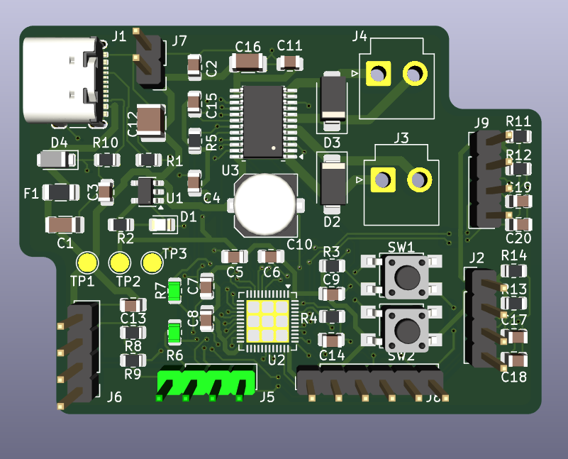
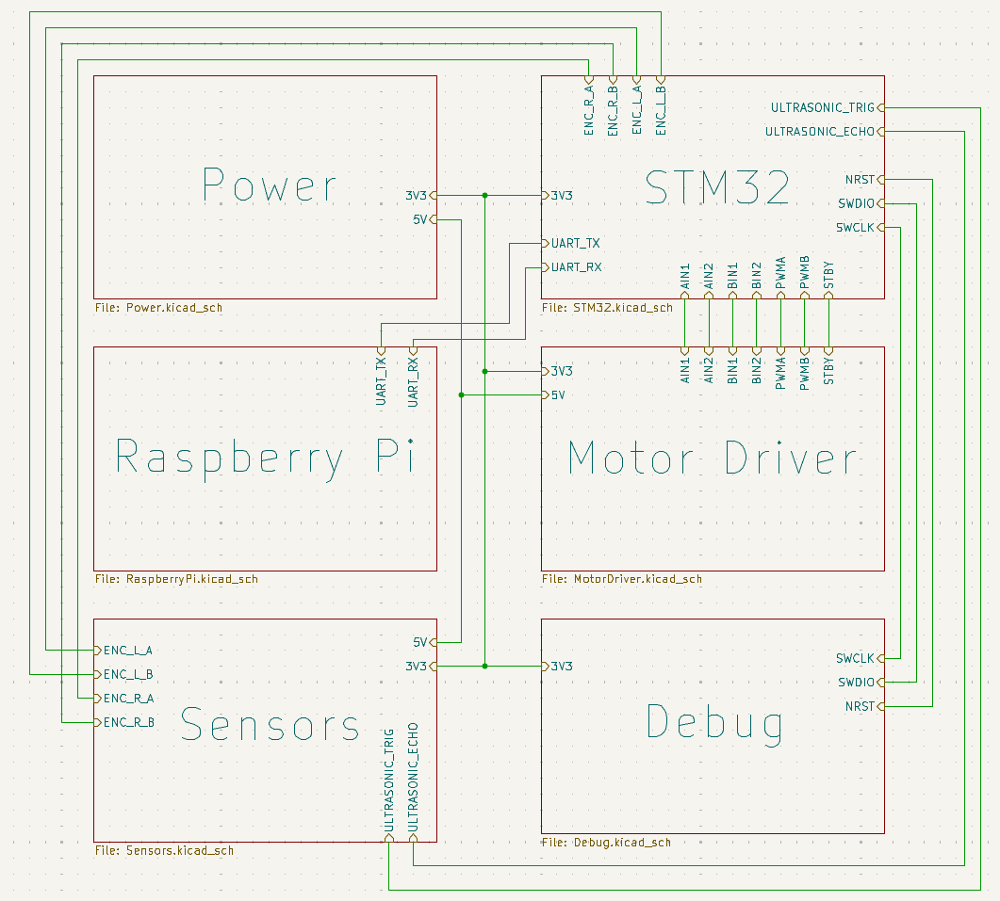
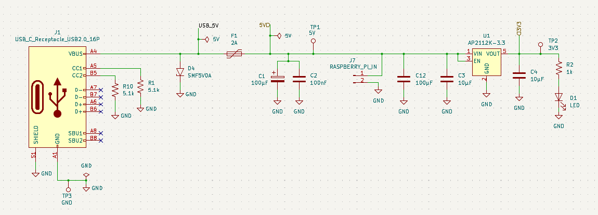
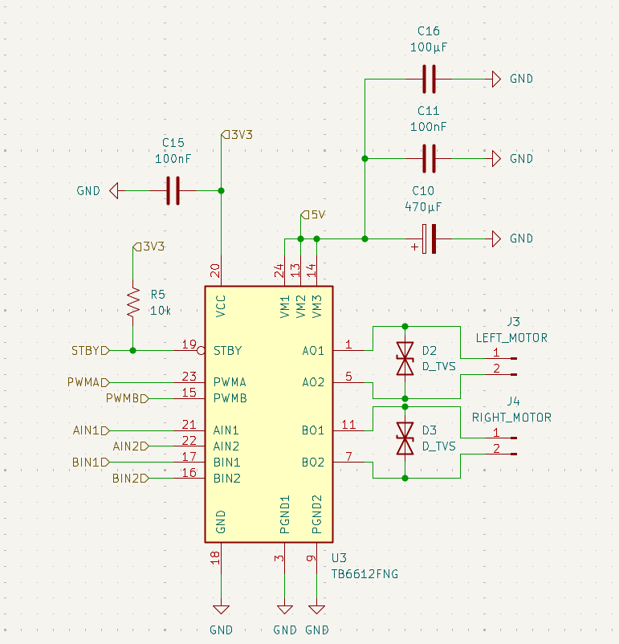
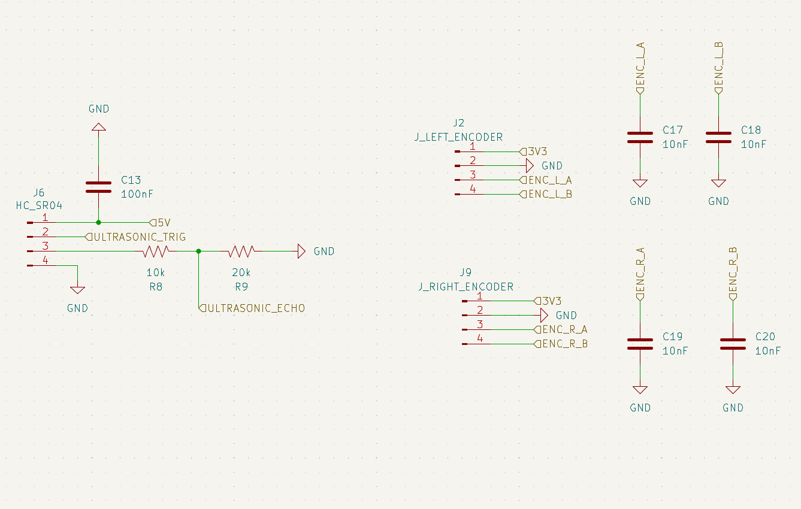
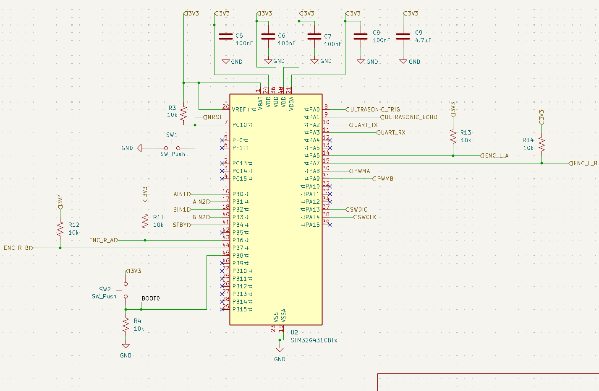
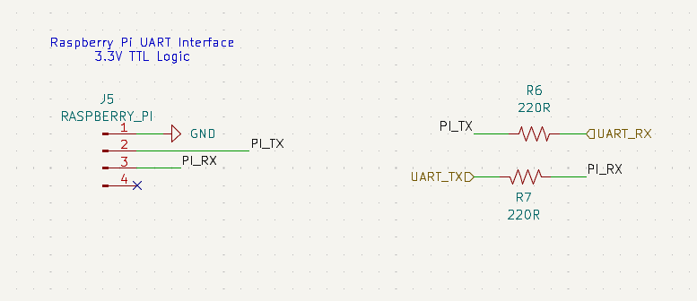
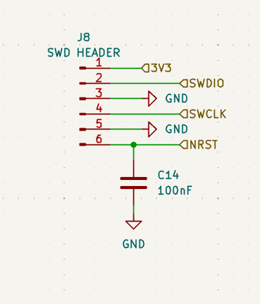

# Autonomous Ball Tracking Robot


A two-wheeled robot that visually tracks and follows a red ball. A Raspberry Pi handles vision (Picamera2 + OpenCV) and sends drive commands over UART to a custom STM32-based motor controller PCB, which closes the loop with encoder feedback and PID.

I designed the controller PCB from scratch in KiCad and wrote the embedded firmware in C (STM32CubeIDE, HAL).

**Skills demonstrated:** PCB design (KiCad) · embedded C / STM32 HAL · real-time control loops (PID) · digital/analog circuit design (power regulation, signal protection) · computer vision (OpenCV) · serial communication protocol design

## System Architecture


```
┌──────────────────────────┐        UART (115200)          ┌──────────────────────────────┐
│       Raspberry Pi       │ ───────────────────────────▶ │   STM32G431CBTx (custom PCB) │
│  Picamera2 + OpenCV      │   single-char commands       │                               │
│  red-ball detection /    │   F / B / L / R / S          │  50 Hz PID loop, quadrature   │
│  centroid tracking       │                              │  encoders, TB6612FNG motor    │
└──────────────────────────┘                              │  drivers, HC-SR04 ranging     │
                                                          └───────────────────────────────┘
                                                                     │           │
                                                              ┌──────┘           └──────┐
                                                         Left DC motor            Right DC motor
                                                          + encoder                + encoder
```

The Pi owns perception and high-level decisions (where's the ball, which way to turn); the STM32 owns real-time control (closing the velocity loop on each wheel and keeping the robot safe if the link drops).

## Hardware



Custom 2-layer controller PCB designed from scratch in KiCad 9 (schematic + layout), organized into hierarchical sheets by subsystem.




### Power (`Power.kicad_sch`)
- **Input:** USB-C receptacle, with 5.1kΩ pull-down resistors on the CC1/CC2 lines so the port correctly advertises itself to a USB-C source as a 5V/default-current sink.
- **Protection:** A resettable polyfuse (2A) guards the input against overcurrent/short circuits, and SMF5V0A TVS diodes clamp transient voltage spikes on the input.
- **Regulation:** An AP2112K-3.3 LDO steps the 5V USB rail down to 3.3V for the STM32 and logic-level signals, bulk/decoupling caps (10 µF, 100 µF) on both rails.
- **Status indication:** Power-good LEDs on the 5V and 3.3V rails; test points (TP1–TP3) broken out for probing key rails during bring-up/debug.
- Both 5V and 3.3V are distributed to the Raspberry Pi header, so the Pi is powered directly from the board rather than needing its own separate supply.



### Motor Driver (`MotorDriver.kicad_sch`)
- A single **TB6612FNG** dual H-bridge IC drives both DC motors (one chip, two independent channels — no need for two separate driver ICs).
- The STM32 drives `AIN1/AIN2`/`BIN1/BIN2` for direction and `PWMA`/`PWMB` (from TIM1 CH1/CH2) for speed, with `STBY` used to enable/disable the driver in firmware.
- Bulk capacitance (470 µF + 100 µF) sits close to the motor supply input to absorb the current spikes motors draw on startup/direction changes.
- TVS diodes across the motor connector outputs suppress the inductive kickback/flyback transients DC motors generate when switching direction.



### Sensors (`Sensors.kicad_sch`)
- **HC-SR04 ultrasonic:** `TRIG`/`ECHO` connect directly to the STM32 (PA0/PA1). Since the HC-SR04's echo pin outputs a 5V logic level and the STM32 is 3.3V-tolerant, a resistive divider (20kΩ/10kΩ) steps the echo signal down to a safe ~3.3V before it reaches the MCU pin.
- **Quadrature encoders:** Separate 4-pin headers for the left and right motor encoders, each feeding an A/B channel pair into the STM32's hardware timer encoder inputs (TIM3 for one wheel, TIM4 for the other).
- Small filtering capacitors (10 nF) on the encoder/sensor lines to help reject electrical noise from the nearby motors.



### MCU (`STM32.kicad_sch`)
- STM32G431CBTx (Arm Cortex-M4, 170 MHz), with standard decoupling capacitors on all supply pins plus a bulk 4.7 µF cap.
- BOOT0 and NRST have pull resistors for reliable reset/boot behavior; two push buttons (SW1/SW2) are broken out for reset and boot-mode selection during flashing/debug.



### Raspberry Pi Interface (`RaspberryPi.kicad_sch`)
- A 4-pin header carries 5V, 3.3V, and UART TX/RX between the board and the Raspberry Pi's GPIO header.
- Series resistors (220Ω) on the UART lines add a layer of protection against miswiring/contention; no level shifting is needed since both the STM32 and Pi run 3.3V logic.



### Debug (`Debug.kicad_sch`)
- 6-pin SWD header (SWDIO, SWCLK, NRST, 3V3, GND) for programming and debugging the STM32 with an ST-Link, independent of the USART2 link to the Pi.

**Key parts:** STM32G431CBTx · TB6612FNG motor driver · HC-SR04 ultrasonic sensor · 2x quadrature encoders · AP2112K-3.3 LDO · USB-C power input · SMF5V0A TVS protection

## Firmware (STM32, C / HAL, STM32CubeIDE)

| Module | Responsibility |
|---|---|
| `main.c` | System init, 50 Hz control loop scheduling, 10 Hz ultrasonic scheduling |
| `motor.c/h` | PWM + direction output to the TB6612FNG (TIM1 CH1/CH2, AIN/BIN GPIO) |
| `encoder.c/h` | Reads TIM3/TIM4 in quadrature (TI12) encoder mode, converts counts to counts/sec |
| `pid.c/h` | Per-wheel velocity PID with conditional-integration anti-windup |
| `uart_control.c/h` | Parses single-character drive commands from the Pi over USART2 (interrupt-driven) |
| `ultrasonic.c/h` | Software-timed HC-SR04 ranging using the DWT cycle counter for microsecond resolution |

### Control loop

- Runs at 50 Hz (`CONTROL_LOOP_PERIOD_MS = 20`): reads both encoders, runs independent PID controllers for the left/right wheel, and writes the resulting PWM + direction to the motor driver.
- Ultrasonic sensing runs on its own 10 Hz cadence, separate from the control loop, since an HC-SR04 read is a blocking, up-to-30 ms operation and would otherwise disturb the PID's timing.

### PID with anti-windup

Each wheel has an independent PID controller operating on measured wheel speed (encoder counts/sec) with output clamped to a ±1000 PWM range. Integral accumulation uses **conditional integration**: once the output saturates, the integral term stops accumulating unless the error is already pulling it back out of saturation. This prevents the classic windup overshoot where a saturated integrator keeps growing while the motor is already maxed out.

### Quadrature encoding

Wheel encoders are read using the STM32's hardware timer encoder mode (`TIM_ENCODERMODE_TI12`) on TIM3/TIM4, decoding both edges of both channels for full 4x quadrature resolution and reliable direction sensing, rather than software-polling the encoder pins.

### UART command protocol + failsafe

The Pi sends single-byte commands over USART2 (interrupt-driven RX):

| Command | Action |
|---|---|
| `F` | Forward |
| `B` | Backward |
| `L` | Turn left |
| `R` | Turn right |
| `S` | Stop |

If no byte arrives for 500 ms (e.g. the Pi crashes or the link drops), the firmware automatically zeroes both wheel targets and stops the robot — the robot doesn't require a "stop" command to fail safe.

### Ultrasonic ranging without a timer channel

The HC-SR04's echo line isn't wired to a timer input-capture pin, so pulse width is timed in software using the Cortex-M4's DWT cycle counter, giving microsecond-level resolution independent of the main loop's timing.

## Vision (Raspberry Pi, Python)

`ball_tracker.py` captures frames with Picamera2, finds the ball with OpenCV, and streams drive commands to the STM32 over the same UART protocol the firmware implements.

**Detection:** Frames are converted to HSV and thresholded for red across two hue ranges (red wraps around hue 0/180 in OpenCV's HSV space), combined into one mask, then cleaned up with erosion/dilation to remove noise. The largest contour's minimum enclosing circle gives the ball's center and apparent radius.

**Decision logic:** The ball's horizontal offset from frame-center picks a turn command first (turning takes priority so the robot centers on the ball before closing distance); once centered, the ball's apparent radius acts as a distance proxy — small radius drives forward, large radius backs up, and an in-between radius holds position.

**Serial keepalive thread:** The STM32 firmware stops the motors if it doesn't receive a UART byte within 500 ms. Rather than tying that timing to the camera's frame rate, `SerialCommander` runs a dedicated background thread that resends the current command every 150 ms on its own schedule — so a slow or dropped camera frame can never cause an unexpected stop or leave a stale command running longer than intended.

**Debounced ball loss:** Losing the ball for a single frame doesn't stop the robot; it keeps issuing the last command until the ball has been missing for a full second, avoiding jerky stops from momentary detection blips.

Run it with:
```bash
pip install picamera2 opencv-python pyserial numpy
python3 ball_tracker.py
```
Requires UART enabled via `raspi-config` (Interface Options → Serial Port) and, on Pi models where UART is routed through Bluetooth, `dtoverlay=disable-bt` in `/boot/firmware/config.txt`. Wiring: Pi GPIO14 (TX) → STM32 PA3 (RX), Pi GPIO15 (RX) → STM32 PA2 (TX), common ground — both sides are 3.3V logic, no level shifter needed.

## Repository Structure

```
Ball_Tracking_Robot/
│
├── README.md
├── .gitignore
│
├── hardware/                         # Custom PCB design files
│   │
│   └── PCB/
│       │
│       ├── KiCad/
│       │   ├── Ball_Tracking_Robot_Controller.kicad_pro
│       │   ├── Ball_Tracking_Robot_Controller.kicad_sch
│       │   ├── Ball_Tracking_Robot_Controller.kicad_pcb
│       │   │
│       │   ├── STM32.kicad_sch
│       │   ├── Power.kicad_sch
│       │   ├── MotorDriver.kicad_sch
│       │   ├── Sensors.kicad_sch
│       │   ├── RaspberryPi.kicad_sch
│       │   ├── Debug.kicad_sch
│       │   │
│       │   └── fp-info-cache
│       │
│       │
│       ├── Gerbers/                  # Manufacturing files
│       │       ├── *.gbr
│       │       └── *.drl
│       │
│       ├── BOM/
│       │    └── Ball_Tracking_Robot_BOM.csv
│       │   
│       │
│       └── schematic.png
│
│
├── firmware/                         # STM32 embedded firmware
│   │
│   └── STM32CubeIDE/
│       │
│       ├── Core/
│       │   │
│       │   ├── Inc/
│       │   │   ├── main.h
│       │   │   ├── motor.h
│       │   │   ├── encoder.h
│       │   │   ├── pid.h
│       │   │   ├── uart_control.h
│       │   │   ├── ultrasonic.h
│       │   │   ├── stm32g4xx_hal_conf.h
│       │   │   └── stm32g4xx_it.h
│       │   │
│       │   └── Src/
│       │       ├── main.c
│       │       ├── motor.c
│       │       ├── encoder.c
│       │       ├── pid.c
│       │       ├── uart_control.c
│       │       ├── ultrasonic.c
│       │       ├── stm32g4xx_hal_msp.c
│       │       ├── stm32g4xx_it.c
│       │       └── system_stm32g4xx.c
│       │
│       ├── Drivers/
│       │   ├── CMSIS/
│       │   └── STM32G4xx_HAL_Driver/
│       │
│       ├── STM32CubeMX/
│       │   └── Ball_Tracking_Robot.ioc
│       │
│       ├── .project
│       └── .cproject
│       
│ 
│
├── software/                         # Raspberry Pi software
│   │
│   └── RaspberryPi/
│       │
│       └── ball_tracking.py
│
│
│
│
└── tests/                            # Hardware/software validation tests
    │
    ├── uart_test/
    │   └── uart_test.py
    │
    ├── encoder_test/
    │   └── encoder_test.c
    │
    └── motor_test/
        └── motor_test.c
```

## Getting Started

### Hardware
1. Open `Ball_Tracking_Robot_Controller.kicad_pro` in [KiCad 9](https://www.kicad.org/).
2. Review schematics/PCB layout, generate Gerbers/BOM for fabrication and assembly.

### Firmware
1. Import the `firmware/` sources into an STM32CubeIDE project targeting the STM32G431CBTx.
2. Flash over the onboard SWD header with an ST-Link.
3. Connect USART2 (PA2/PA3) to the Raspberry Pi's UART pins.

### Vision
1. On the Raspberry Pi, install dependencies and run `vision/ball_tracker.py` (see the Vision section above for setup details).
